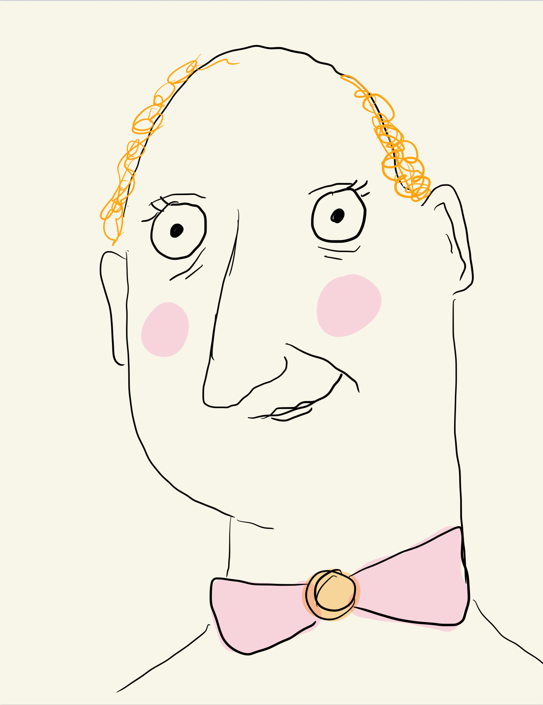

# Welcome to My Site

Hello! This website is mostly for random physics content.

Here is a photo of me :)

<!-- in index.md -->

# About me 

It all started in 1967. That's when I was born and first felt the breeze on my bald scalp. I was born bald unfortunately, and I am currently returning back to my initial state. My father was in Vietnam when I was born. He wasn't even drafted, he just wanted to go (maybe it was my mom's cooking). My father wasn't around much growing up, I mean even when he was physically near, he wasn't really there. He never really came back from Vietnam if you know what I mean. A part of him was eternally in those rice paddies. All I ever wanted to do was toss the pigskin with my father, but he never once took me up on the offer. For that reason, I was always scared of sports. I never went to my high school football game because it reminded me of the childhood I never had. I never even played kickball with my friends during lunch. I think I went 25 years without ever breaking a sweat, that is until the heat wave of 1992. While all the other kids were out having fun, I was digging my nose into a physics book. Yes, it's correct I did not have any friends. I was also a bit plus sized but that didn't really bother me because I didn't like moving anyway. It wasn't until I was nearing the end of high school when I realized my mom was a drunk and my father was addicted to drugs. He was so full of drugs with the radio on, he didn't even notice the revolving door of men that my mother had coming through the house. I think she did it to get a reaction from him, to see that he still cared. But a reaction never came, and so she hit the bottle to find refuge from her loneliness. When I became aware of my parent's flaws, I buried myself deep into my physics studies to try and drown out the sickening reality around me. This paid off and I was able to get into West Virginia state university. I didn't really meet many people in undergrad. I was now afraid of both alcohol and sweating, which turned me away from most group activities. I remember this one hot dog stand though. It was near the physics building and I had four hot dogs for lunch every day. Slowly, I began to befriend this guy at the hot dog stand. His name was Ralph. The curious thing about him is that he never ate a single hot dog his entire life. I started buying breakfast and dinner at the hot dog stand just to have a chance to talk to Ralph more and get some human connection. I never once considered what this would do to my physique. Well after four years, I had my bachelors, and I had also tripled in size. For a while I blamed Ralph for my body. I would lay awake at night and fantasize about driving down to Charleston and pouring pink paint all over his hot dog stand. Back then the world was really homophobic and so I knew that he would lose a lot of business if the hot dog stand was pink. I would hang around outside bars and tell every passerby that Ralph's hot dogs were made from dog meat. I am not proud of this. In fact this is the first time I am admitting this out loud. Then I was hit by a drunk driver while making up rumors about Ralph's hot dogs. I was in a coma for several weeks. When I woke from the coma, there was a single card on by bedside. It was from Ralph. I realized that he was truly my only friend. I had also lost some weight in the coma and was feeling better about myself. So I decided to forgive Ralph and move on. He is still my dear friend to this day...

#Contact Info

If you would like to contact me for any questions or comments please email me at strawberrysteve67@gmail.com

